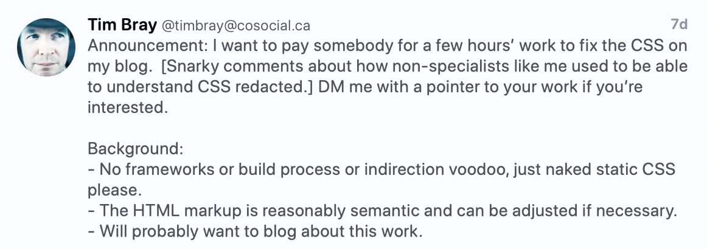
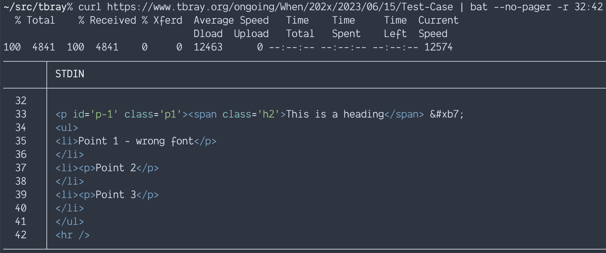
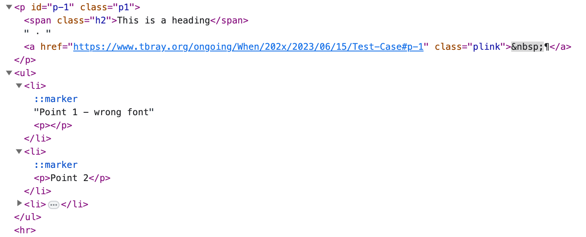

# Context
The other day @timbray posted:

<a href="https://cosocial.ca/@timbray/110543834889537732">
</a>

@danielmorrison volunteered @mattslack as tribute.

# The Ask

> Currently my blog https://www.tbray.org/ongoing relies on a single static CSS file at https://www.tbray.org/ongoing/serif.css (Many years ago I used to offer serif and sans-serif variants of the blog).
> The blog is written in raw XML and the publishing system turns it into XHTML with reasonably good semantic markup.  If it would facilitate fixing the CSS I could update the publishing system to fine-tune the markup.
> The CSS is entirely hand-constructed by myself and is not good.  The blog mostly looks OK but I would like to achieve the following:
> 1. Have the text be readable on as wide a variety as possible as different screen sizes and shapes. Something seems to have broken recently, the text is unreadably tiny on Android.
> 2. If I put in an image that is too tall-and-narrow (I can supply an example) the text tries to wrap around it, I want images strictly in-line with the main column.
> 3. I’d like images to extend out to the left, to the edge of the screen if they’re wide enough.
> 4. If I have a header and then drop into an \<ol\> or \<ul\> without having a \<p\> after the header, the first list item gets a deformed font.
> 5. The text comes too close to the top of images (OK, I could fix that one).
> 6. I’d like anything that is hideously wrong in my current CSS replaced with something modern and good.


# First pass

## 1. Readability

* [5e05a3c](https://github.com/collectiveidea/ongoing/commit/5e05a3cea3463cd064b42d1f8d9020a701528fa0) Added a viewport meta tag (Tim will make these changes to production). This will prevent some of the truly weird font-size issues.
    ```
    <meta name="viewport" content="width=device-width, initial-scale=1.0, shrink-to-fit=no">
    ```
* [7ecb2e8](https://github.com/collectiveidea/ongoing/commit/7ecb2e826da540739ffb8c3ab155c78da2c56721) Stacked the `#rightcontent` under the `#centercontent` until the viewport is wide enough to support both (560px seemed like a reasonable breakpoint, but we can change this depending on feedback).

## 2. Tall narrow images and wrapping text

Currently, we're not seeing this behavior (neither is Tim, this isn't a "Works on my machine"). So we'll circle back if new information is available.

## 3. Images extending out to the left

This also looks fine to me, but I haven't clarified yet, may be a focus for the second pass

## 4. List item issues

In the example page the list item styling is not strictly a CSS issue. I could make it look right with CSS, but it’s really a markup problem, and should probably be fixed there.
It looks like, at some point, things are getting mangled.

This is what the server kicks out:



So there’s two problems with that:

1. A `<ul>` can’t be a direct child of a `<p>`
2. The closing `</p>` inside the `<li>` on line 35 is lonely

This is how it’s interpreted by the browser:



Since the `<ul>` can’t be inside the `<p>` that gets auto-closed.
The orphaned closing tag inside the `<li>` gets auto-opened, but is empty and doesn’t really affect anything.
The first `<li>` doesn’t get paragraph stylings at all, because it’s been pulled out of them.

## 5. Spacing above images

* [6f9a813](https://github.com/collectiveidea/ongoing/commit/6f9a813b2348bd22e5c0efce879808603d19f83c) Added some spacing.

## 6. Fix anything hideously wrong

Not necessarily a lot of stuff is _wrong_, but days could be spent tweaking given the chance.

There are some stylistic changes that could be made (e.g. reorganizing into more logical, or specificity based, chunks), I'd argue that it's for "maintainability" but a lot of it is just personal preference (like my hatred of id-based selectors).

* [7479e65](https://github.com/collectiveidea/ongoing/commit/7479e657da9283db2bc84cd2a0491836ca28f785) Fixed one syntax error (poorly closed comment).

* [5e12d60](https://github.com/collectiveidea/ongoing/commit/5e12d602c1b04881440002bfe7fabbdefc6c8440) Swapped out absolute positioning for the column layout for grid (where supported).

    We could refactor the banner in the same way, but there's a strong chance the search will overlap the title (there is with the existing absolute positioning too), so we need to think about how best to jigger the design. (Taller banner? Smaller headline type? Something else?)


# Second Pass

## 1. Readability

* Shrink the `h1` on smaller screens

## 3. Images expanding to the left

* Make sure the grid layout doesn't en-narrow images. Using `fr` units for the column prevented expanding outside the column, so we needed to define it with something else (pixels in this instance, though I believe other units would work)
* Set the max-width of the image so it goes to the edge of the viewport, but not wider.

## New: Make sure the full-size image pages render correctly

* 32a5866 Fix my fix to the syntax error from 7479e65
* f102e87 Prevent the image caption from growing the page

# Additional revisions

* Make the header text smaller where appropriate
* Numerous margin/padding/spacing tweaks
* Update any pixel based font-sizes to use rems
